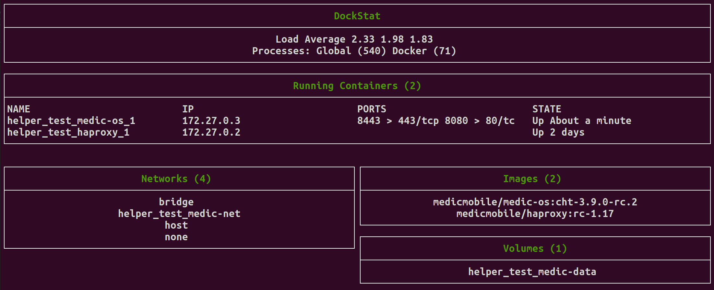

# DockStat

DockStat is a Bash script to show output of running Docker containers:

This is mainly good for small, developer Docker setups.  It was originally created to monitor from two to eight containers that were continually being brought up and down and being pruned.  Otherwise, for example, if Docker is used a lot with many disperate containers thus has lots images cached, DockStat lists ALL your images.  Displaying dozens or more images will likely break the display functionally.  KISS, 'kay?!

DockStat is based off [Simple Curses](https://github.com/metal3d/bashsimplecurses/) library to render the output in Bash.